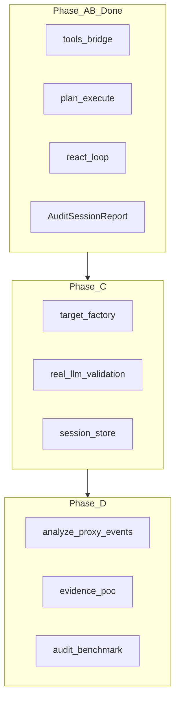

# 自主审计智能体 — Phase C+ 执行文档

> 前置：[autonomous-audit-agent.md](autonomous-audit-agent.md) 中 Phase A（Plan-and-Execute）与 Phase B（ReAct）已完成。  
> 目标：从「本地 Demo 闭环智能体」升级为「可打真实目标、可留存、可回归」的完整审计产品。  
> 技术约定：**不引入 LangChain 硬依赖**，复用已有 `OpenAICompatLLM` + `ChatMessage` / `ToolCall` 协议。  
> 总体愿景仍见仓库根目录 `agent-security-project-design.md`。

---

## 0. 定位升级

| 层级 | 定义 | 当前 | Phase C+ 后 |
|------|------|------|-------------|
| L1 闭环智能体 | Tools + Loop + Memory + Report | 已达 | 保持 |
| L2 实战智能体 | 多 Target + 真实 LLM 验收 + 会话存档 | 未达 | C1–C3 |
| L3 运营智能体 | Proxy 联动 + 定时审计 + 质量回归 | 未达 | D1–D3 |
| L4 产品智能体 | 攻击链编排 + 证据报告 + HITL | 未达 | E1–E3 |



### 0.1 与 Phase A/B 的能力边界

Phase A/B 已交付：

- 12 个 `AttackModule` → 指挥官 Tool（`orchestrator/tools_bridge.py`）
- Plan / ReAct 两套主循环（`plan_execute.py` / `react_loop.py`）
- ReAct 会话记忆（`memory.py` + `AttemptLog`）
- 会话级 `AuditSessionReport` + JSON/Markdown 报告

Phase C+ 补的是**实战化与运营化**，不改变武器库与 A/B 主循环契约。

---

## 1. Phase C — 实战化（优先，1–2 周）

目标：审计智能体可对真实 HTTP 黑盒目标运行、真实 LLM 行为可验收、会话报告可持久化查询。

### 1.1 任务清单

- [x] **C1 — Target 适配层统一**

  **问题**：`audit` / Web 自主审计硬编码 `build_local_target`，`HttpAgentTarget` 未接入 Orchestrator。

  - [x] **C1.1** 新增 `orchestrator/target_factory.py`
    - `build_audit_target_factory(spec: AuditTargetSpec) -> Callable[..., AgentTarget]`
    - `spec.kind`: `local` | `http`
    - `http` 时：`base_url`, `timeout`；黑盒下 `defense` 为 no-op 或文档说明
  - [x] **C1.2** CLI 扩展
    ```bash
    agent-shield audit --target local --llm mock
    agent-shield audit --target http --url http://127.0.0.1:8000 --mode react
    ```
  - [x] **C1.3** Web `AutoAuditRequest` 增加 `target_kind` / `target_url`
  - [x] **C1.4** 黑盒下自动过滤 `mock_only` 模块并在 UI 提示

- [x] **C2 — 真实 LLM 指挥官验收套件**

  **问题**：Mock 脚本让 plan/react 结果相近；接 API 后的自适应能力未系统验收。

  - [x] **C2.1** 新增 `tests/fixtures/react_scenarios/`：脚本化「失败→改参」「换模块」场景
  - [x] **C2.2** 新增 `tests/test_audit_real_llm.py`（`@pytest.mark.integration`，需 `AUDIT_LLM_*` 环境变量）
  - [x] **C2.3** 新增 `docs/prompt-tuning.md`（Prompt 调优清单）
    - ReAct：失败时必须先 Reflection 再 Action
    - 禁止连续 3 轮只调 `list_coverage`
  - [x] **C2.4** Web 自主审计页增加 Mock 提示：
    > 离线 Mock 下 plan/react 结果相近；选 OpenAI 兼容 + API Key 后 react 才会自适应。

- [x] **C3 — 审计会话持久化**

  **问题**：`AuditSessionReport` 仅内存返回，刷新即失。

  - [x] **C3.1** 扩展 `proxy/audit.py` 或新建 `orchestrator/session_store.py`
    ```sql
    audit_sessions(id, ts, mode, target_spec, task, report_json, markdown)
    ```
  - [x] **C3.2** `audit` CLI：`--save`（默认开启）+ `--session-db`（默认 `~/.agent-shield/audit_sessions.db`）
  - [x] **C3.3** Web API：
    - `GET /api/auto-audit/sessions`
    - `GET /api/auto-audit/sessions/{id}`
  - [x] **C3.4** 前端「历史会话」列表 + 点击查看 Markdown 报告

### 1.2 Phase C 验收（Must）

| ID | 标准 |
|----|------|
| V-C1 | 对 `http-agent` 跑通 plan/react，报告 `mode` 正确 |
| V-C2 | 黑盒跑 `rogue_agent` 不崩溃，记入 skipped/error |
| V-C3 | integration 测试下 react 在 scripted 失败场景产生 `bypass_index > 0` |
| V-C4 | 真实 LLM（可选）跑 1 次 react，`finish_audit` 被调用且报告合法 |
| V-C5 | 连续跑 2 次 audit，历史列表可见 2 条 |
| V-C6 | 报告 JSON 可 `AuditSessionReport.model_validate` 反序列化 |

---

## 2. Phase D — 智能化与联动（1–2 周）

目标：旁路流量可驱动狩猎、报告含 PoC 级证据、指挥官行为可回归测试。

### 2.1 任务清单

- [x] **D1 — Proxy → Audit 狩猎闭环**

  **问题**：MITM Proxy 记 SQLite，Audit Agent 不读。

  - [x] **D1.1** 元工具 `analyze_proxy_events`
    - 读 `AuditStore.latest(n)` / 按时间窗查询
    - 返回：高频 tool、detection 摘要、可疑模式
  - [x] **D1.2** ReAct Prompt 规则：若用户提供 `--proxy-db`，首轮可先 `analyze_proxy_events`
  - [x] **D1.3** Web：审计页增加「基于此流量发起自主审计」按钮

- [x] **D2 — 证据增强与 PoC 报告**

  **问题**：终报偏数字统计，缺可交付的 PoC。

  - [x] **D2.1** `AuditStepResult` 增加 `evidence_refs: list[str]`（指向 case id / trace 片段）
  - [x] **D2.2** `session_report_to_markdown` 增加「高危发现」节：成功 case 的 payload + 工具链
  - [x] **D2.3** 可选 `--export-traces` 导出完整 `AgentTrace` JSON

- [x] **D3 — 指挥官质量回归（Benchmark for Agent）**

  **问题**：改 Prompt 无自动化回归。

  - [x] **D3.1** 新增 `core/audit_benchmark.py`
    - 固定场景：3 mock 目标配置 × plan/react
    - 指标：`modules_covered`, `risk_level`, `bypass_used`, `turns`, `finish_called`
  - [x] **D3.2** CLI：`agent-shield audit-benchmark --quick`
  - [x] **D3.3** CI：quick benchmark 无外网必过；integration 可选

### 2.2 Phase D 验收（Must）

| ID | 标准 |
|----|------|
| V-D1 | 注入 proxy 样本事件后，audit 报告 `modules_planned` 含与检测相关的模块 |
| V-D2 | Markdown 含至少 1 条可复制 PoC（注入文本 / 工具调用参数） |
| V-D3 | 改坏 Prompt 后 benchmark 指标可检测退化（阈值断言） |

---

## 3. Phase E — 产品化增强（可选，2+ 周）

目标：复合攻击链、MCP 目标、运营级能力。

### 3.1 任务清单

- [x] **E1 — 显式多步攻击链**
  - [x] `AuditChainStep`：前置模块输出作为后置 `params` 输入
  - [x] 元工具 `propose_chain` / `run_chain_step`
  - [x] Web 时间线展示「链式」依赖边

- [x] **E2 — MCP / Connector 纳入 Orchestrator**
  - [x] `AuditTargetSpec.kind = mcp`
  - [x] 复用 `connectors/mcp.py` 构建 Target
  - [x] 新增 MCP 投毒攻击模块与 audit 联动

- [x] **E3 — 运营能力**
  - [x] 定时任务：`agent-shield audit-schedule --cron "0 2 * * *"`
  - [x] Token/费用估算（每次 `planner.chat` 记 usage）
  - [x] 危险模块 HITL：Web 弹窗确认后再执行 `unexpected_code_execution` 等

---

## 4. 推荐实施顺序（工程日历）

| 顺序 | 项 | 预估 | 依赖 | 价值 |
|------|-----|------|------|------|
| 1 | C1 Target 统一 | 1–2 天 | Phase A/B | 立刻能打真实 HTTP Agent |
| 2 | C2 真实 LLM 验收 | 1 天 | C1 | 证明 react 比 plan 强 |
| 3 | C3 会话持久化 | 1 天 | Phase A/B | Demo/面试可展示历史 |
| 4 | D2 证据报告 | 1 天 | Phase A/B | 报告像真实渗透交付物 |
| 5 | D1 Proxy 联动 | 1–2 天 | C1 | 攻防一体故事闭环 |
| 6 | D3 质量回归 | 0.5 天 | C2 | 长期维护不翻车 |
| 7 | E* 产品化 | 按需 | C+D | 开源项目成熟度 |

**建议先合并 C1 + C2 + C3**，再对外宣称「完整实战智能体」。

---

## 5. 验收标准总表

| ID | 标准 | Phase |
|----|------|-------|
| V-C1 | HTTP 黑盒 target 跑通 audit | C |
| V-C2 | mock_only 在黑盒优雅降级 | C |
| V-C3 | react 失败改参路径有自动化测试 | C |
| V-C4 | 真实 LLM react 终报合法 | C |
| V-C5 | 会话可查询、可回放 | C |
| V-C6 | 报告 JSON 可反序列化校验 | C |
| V-D1 | Proxy 事件可驱动审计模块选择 | D |
| V-D2 | 报告含 PoC 级证据 | D |
| V-D3 | audit-benchmark 可检测 Prompt 退化 | D |
| V-R | 现有 `attack` / `benchmark` / `demo` 回归不破坏 | C+ |

---

## 6. 与「五步工程」的映射（面试叙事）

| 用户五步 | Phase A/B 动作 | Phase C+ 增强 |
|----------|----------------|---------------|
| ① 定义工具箱 | `tools_bridge` | D1 增加 `analyze_proxy_events` |
| ② 审计规划器 Prompt | `prompts.py` | C2 Prompt 调优 + D3 回归 |
| ③ 主循环 | plan / react loop | C1 多 Target 工厂 |
| ④ 记忆与状态 | `SessionMemory` | C3 会话持久化 |
| ⑤ 结构化报告 | `AuditSessionReport` | D2 PoC 证据增强 |

升级后的面试表述：

> 外层是指挥官 Agent（Plan/ReAct），中层是 ASI 武器插件，内层是靶场 Agent；  
> 支持本地白盒与 HTTP 黑盒；旁路 Proxy 流量可触发主动狩猎；  
> 会话报告持久化，数字指标本地聚合防幻觉。

---

## 7. 明确非目标（仍不做）

- LangChain / CrewAI 等框架 Connector 硬依赖（设计稿 §4.1 中的 Adapter 可后补薄封装）
- 零样本强化学习 / 自动发现新漏洞
- 多租户 SaaS 计费系统
- 真实远程黑盒的自适应指纹与零样本策略学习

上述不影响 Phase C/D 主路径；需要时另开设计修订。

---

## 8. 相关文档

- [自主审计智能体 Phase A/B 执行文档](autonomous-audit-agent.md) — 已完成的基础闭环
- [Prompt 调优清单](prompt-tuning.md) — 指挥官 ReAct/Plan 调优与回归
- [架构说明](architecture.md) — 现有分层与靶场循环
- [攻击分类](attack-taxonomy.md) — ASI / ATLAS 对照
- [使用指南](usage-guide.md) — 现行 CLI
- 仓库根目录 `agent-security-project-design.md` — 选题与总设计愿景
